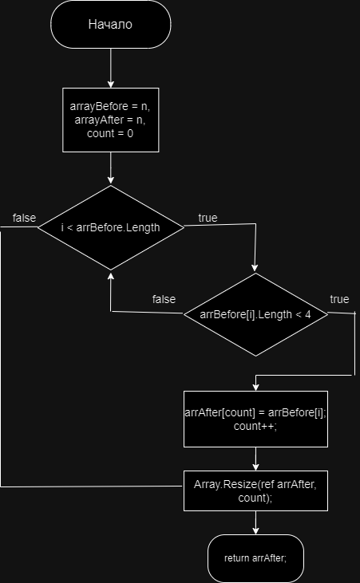

# Итоговая контрольная работа
## Условия задачи 
1. Создать репозиторий на GitHub
2. Нарисовать блок-схему алгоритма (можно обойтись блок-схемой основной содержательной части, если вы выделяете её в отдельный метод)
3. Снабдить репозиторий оформленным текстовым описанием решения (файл README.md)
4. Написать программу, решающую поставленную задачу
5. Использовать контроль версий в работе над этим небольшим проектом (не должно быть так, что всё залито одним коммитом, как минимум этапы 2, 3, и 4 должны быть расположены в разных коммитах)

**Задача: Написать программу, которая из имеющегося массива строк формирует новый массив из строк, длина которых меньше, либо равна 3 символам. Первоначальный массив можно ввести с клавиатуры, либо задать на старте выполнения алгоритма. При решении не рекомендуется пользоваться коллекциями, лучше обойтись исключительно массивами.**
```
Примеры:
[“Hello”, “2”, “world”, “:-)”] → [“2”, “:-)”]
[“1234”, “1567”, “-2”, “computer science”] → [“-2”]
[“Russia”, “Denmark”, “Kazan”] → []
```
## Блок схема решения 


## Описание решения 
1. Задать начальный массив строк `arrayBefore`
2. В методе `NewArray`
	- Задать выходной массив `arrAfter` с длинной `arrayBefore` и задать счетчик `count = 0;`
    - В цикле for с условием работы цикла `i < arrBefore.Length` пройти по массиву 
        - задать условие `arrBefore[i].Length < 4` которое будет выполняться если <u> длинна элемента массива больше или равна трем </u>
            - добавить в выходной массив `arrAfter` на позицию `count` элемент массива `arrBefore` с индексом i
            - увеличить счетчик на 1 `count++`
    - Изменить размерность выходного массива `arrAfter` на размерность равной счетчику `count`
    - вернуть массив строк `arrAfter`
3. Вывести в консоль выходной массив `arrAfter`